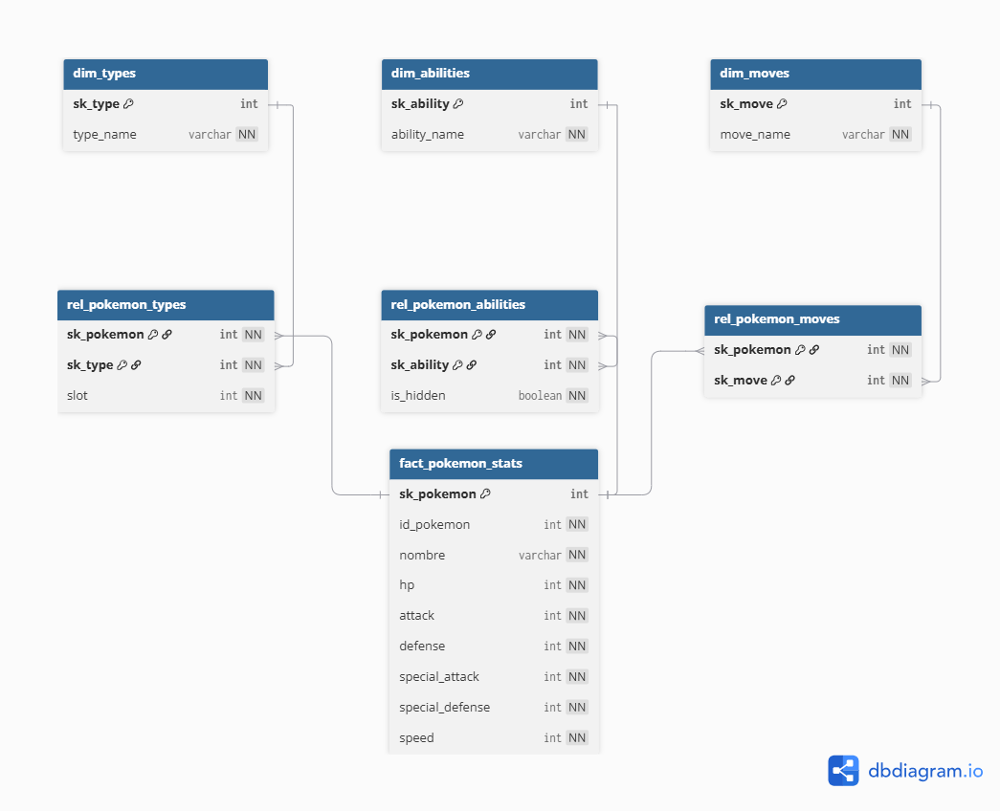

# Prueba Técnica - PokeAPI Architecture & Analytics

### Modelo Dimensional (Esquema Snowflake)

## Part 1: Data Warehouse & Dimensional Modeling (Snowflake Schema)

### Sustentación Técnica del Modelo

#### 1. Grano de la Tabla de Hechos (`fact_pokemon_stats`)
El grano de la tabla de hechos se define como **un registro por cada Pokémon individual evaluado**. 

* **Por qué se eligió este grano:** Las preguntas de negocio requeridas por el análisis (identificar al Pokémon con mayor ataque base, calcular el promedio de peso/altura por tipo y contar habilidades) se responden al nivel de entidad de un Pokémon único. No se requiere un grano transaccional (como "por intento de captura" o "por batalla"), sino un grano de estado instantáneo de las características base de cada criatura.
* **Métricas incluidas:** Almacena los valores numéricos aditivos y semi-aditivos que permiten agregaciones directas: `hp`, `attack`, `defense`, `special_attack`, `special_defense`, `speed`, `height` y `weight`.

---

#### 2. Resolución de Dimensiones Múltiples (Relaciones Muchos a Muchos)
Uno de los mayores retos de este modelo es que un Pokémon puede poseer **múltiples habilidades** y **múltiples movimientos**, lo que rompe la relación jerárquica estándar `1:N` de un esquema en estrella puro. Para resolver esto y mantener la integridad del modelo analítico, se implementó una estrategia de **Tablas de Hechos Puente (Bridge Tables)**, típica de la arquitectura Snowflake:

* **Cruce con Habilidades (`dim_pokemon_abilities_bridge`):** Se creó una tabla intermedia que conecta `fact_pokemon_stats` con la dimensión de tipos/habilidades. Cada registro representa la asignación de una habilidad específica a un Pokémon, incluyendo un atributo de contexto como `is_hidden` (si la habilidad es oculta).
* **Cruce con Movimientos (`dim_pokemon_moves_bridge`):** De igual manera, los movimientos se desacoplan mediante una tabla puente que mapea qué Pokémon puede aprender qué movimiento. Esto permite filtrar la tabla de hechos por cualquier atributo del movimiento (como su tipo o generación) sin duplicar las métricas físicas o de estadísticas del Pokémon en la tabla principal.